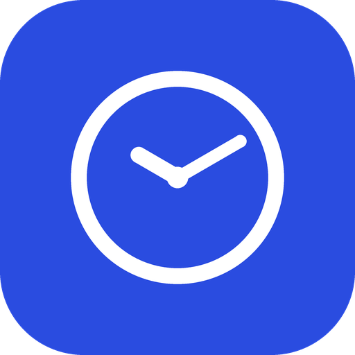

# Ru-Zeiterfassung — Zeiten Berechnen

Windows-Programm für die eigene Arbeitszeit: Stundenlohn, Wochen- und
Tagesmaximum sowie eine automatische Pausenregel eintragen, dann für Montag
bis Freitag Beginn und Ende erfassen — oder den Tag als Urlaub markieren.
Fehlt an einem Tag das Ende, schlägt das Programm die Feierabend-Zeit vor.
Jede Kalenderwoche bleibt dauerhaft editierbar (auch rückwirkend), und das
Programm rechnet Wochenverdienst und Urlaubsentgelt aus. Die Wochentage
stehen nebeneinander mit den Zeiten darunter, und die Einstellungen lassen
sich einklappen — damit passt alles auf einen Blick.



## Wie es rechnet

**Pause:** frei einstellbar (Standard: **6 Stunden**). Bis zu dieser Grenze
zählt alles als Arbeit. Danach sind die nächsten **45 Minuten** automatisch
Pause statt Arbeit, die Zeit danach wieder Arbeit. Beispiel bei Beginn 08:00
und Ende 16:30: 8,5 Stunden Anwesenheit, davon 45 Minuten Pause → 7 Stunden
45 Minuten Arbeitszeit.

**Feierabend-Vorschlag:** für einen Tag ohne eingetragenes Ende berechnet das
Programm die Feierabend-Zeit aus dem, was von Wochen- und Tagesmaximum noch
übrig ist (je nachdem, was zuerst erreicht wird) — inklusive der Pause, die
auf dem Weg dahin noch anfällt.

**Urlaubsentgelt:** nach § 11 BUrlG richtet sich die Bezahlung eines
Urlaubstags nach dem durchschnittlichen Verdienst der **letzten 13 Wochen**
vor dem Urlaub, geteilt durch die Anzahl der in dieser Zeit tatsächlich
gearbeiteten Tage. Das Programm bildet diesen Durchschnitt automatisch aus
allen erfassten Wochen vor der aktuell betrachteten Woche und multipliziert
ihn mit den Urlaubstagen dieser Woche. Vereinfachung: es gibt nur einen
einzigen, flachen Stundenlohn — Sonderfälle des Gesetzes wie
Überstundenzuschläge oder Kurzarbeit werden nicht separat behandelt. Ein
zusätzliches, tarifliches **Urlaubsgeld** (ein Bonus über diese gesetzliche
Fortzahlung hinaus) gibt es nur, wenn Arbeits- oder Tarifvertrag das
vorsehen — das rechnet dieses Programm nicht automatisch mit, weil es dafür
keine einheitliche Regel gibt.

## Bedienung

1. Einstellungen einmalig unter „▸ Bearbeiten" ausfüllen: Stundenlohn,
   Wochen- und Tagesmaximum, Pausenregel. Werden lokal gespeichert; die
   Karte bleibt danach eingeklappt und zeigt nur eine Kurzzusammenfassung.
2. Mit **‹ ›** zwischen Kalenderwochen wechseln, **Heute** springt zur
   aktuellen Woche zurück. Jede Woche — auch vergangene — lässt sich jederzeit
   bearbeiten.
3. Für jeden Tag (Montag bis Freitag, nebeneinander) Beginn und Ende
   eintragen (Format `HH:MM`), oder per Häkchen als **Urlaub** markieren
   (Zeitfelder werden dann gesperrt).
4. **Berechnen** klicken (oder das Fenster einfach schließen — es wird
   beim Schließen automatisch gespeichert).
5. Häufigster Ablauf: Montag bis Donnerstag komplett eintragen, am Freitag
   nur den Beginn — die App schlägt die Feierabend-Zeit vor.
6. Die **Übersicht** unten listet alle erfassten Wochen mit Gesamtstunden
   und Verdienst; „Bearbeiten" springt direkt zu einer Woche, „Leeren" setzt
   ihre Tage zurück.

## Lokal starten (ohne EXE)

```bash
pip install -r requirements.txt
python ru_zeiterfassung.py
```

## EXE selbst bauen (Windows)

Doppelklick auf `build_exe.bat`, oder manuell:

```bash
pip install -r requirements.txt
pyinstaller --noconfirm --onedir --windowed --noupx --name "Ru-Zeiterfassung" --icon "icon.ico" --version-file "version.txt" --add-data "icon.ico;." ru_zeiterfassung.py
```

Das Ergebnis liegt danach unter `dist\Ru-Zeiterfassung\` (und als
`dist\Ru-Zeiterfassung.zip` zum Weitergeben). Ordner-Modus statt einer
einzelnen Datei, weil das bei Virenscannern deutlich seltener Fehlalarme
auslöst.

## Projektstruktur

```
Ru-Zeiterfassung/
├── ru_zeiterfassung.py    Hauptprogramm (CustomTkinter-Oberfläche)
├── berechnung.py           Rechenlogik (Pause/Arbeit/Feierabend/Lohn), ohne UI
├── storage.py / config.py  Lokale JSON-Speicherung neben der exe
├── theme.py / widgets.py   Designsystem, 1:1 aus Ru-Design
├── make_icon.py            erzeugt icon.png / icon.ico (nur Pillow)
├── icon.ico / icon.png     App-Logo
├── requirements.txt
├── build_exe.bat           Windows-Build per Doppelklick
├── version.txt             Versionsinfo fürs EXE (gegen Fehlalarme)
└── README.md
```

## Design

Nach dem gemeinsamen Regelwerk in
[FinnRu007/Ru-Design](https://github.com/FinnRu007/Ru-Design):
weißer Hintergrund, ein Akzent `#2A4CE0`, Pill-Buttons, Manrope/Inter
(Fallback Segoe UI).

## Lizenz

Frei nutzbar für private und interne Zwecke.
